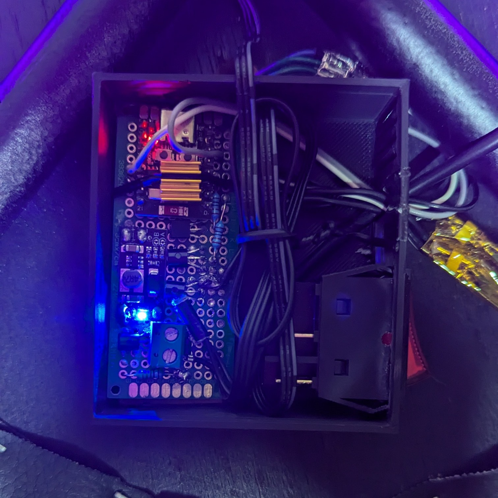

# CyberSitz Pro

The code for the CyberSitz Pro - a modern chair with special features.

## Features
- **ASS** (Advanced Seat Sensing): detects when a person is sitting on the chair
- **Cooling** fan: the integrated and ASS-triggered fan cools with different speed settings
- Bottom Lighting (RGB)
- Rainbow Effect
- Rolls
- Comfortable Leather Seat
- Temperature & Humidity Sensor
- Web Interface (+ multi client support)

  
  

## Electronics
The CSP is mainly run by an ESP32 C3 Mini with a heatsink attached, as the little chip produces a good amount of heat.

For the fan control we used PWM (as always and because it is awesome). To enable PWM we abused the [LEDC library](https://github.com/DoubleD-Software/CyberSitzPro/blob/master/src/main.cpp#L112C13-L112C22). 
This PWM signal is then converted to 12V via the step up converter to drive the fan appropriately. 

The [RGB control](https://github.com/DoubleD-Software/CyberSitzPro/blob/master/src/main.cpp#L113-L115) uses the `analogWrite` which uses PWM as well, as the pins we have selected aren't analog pins. Why doesn't that work for the fan? No idea, stuff just seems to break. The PWM output is then put through a transistor to drive the 5V RGB strip directly from the attached battery instead of through the ESP. (The solder job on those strips was painful.)

Power is provided by a regular 5V USB-A power bank. For that we cut a cable and soldered it to the circuit board. Before going to the rest of the electronics, there is a switch to turn the whole device on and off.

## Software

The software is written in C++ using the Arduino framework. The web interface is built with [ESPAsyncWebServer](https://github.com/me-no-dev/ESPAsyncWebServer) and serves a very simple single page application. 

The web interface is used to control the fan speed and the RGB strip color. It also display the current temperature and humidity, and lets you activity the rainbow effect and the ASS-override. 

The ASS-override is a button in the interface to activate the RGB strips and the fan without it detecting any person actually sitting on the chair. Very useful for demonstration purposes.

This website is also a very good example for implementing support for multiple simoultaneos clients via websockets. The basic loop is as follows:

- receives websocket message to change something
- updates that value
- broadcasts a new message telling every client the new value

It is really satisfying to see this happen in action on multiple devices. 

The color picker is provided by [iro.js](https://iro.js.org). The rest of the page is plain HTML, CSS and JS. 

  
  

(*German: color picker, fan speed, temperature, humidity, color effects (rainbow), ASS-override*)

## 3D Printing

3D printed parts are:

- roll attachments to the legs
- power bank holder
- electronics case with embedded DoubleD logo